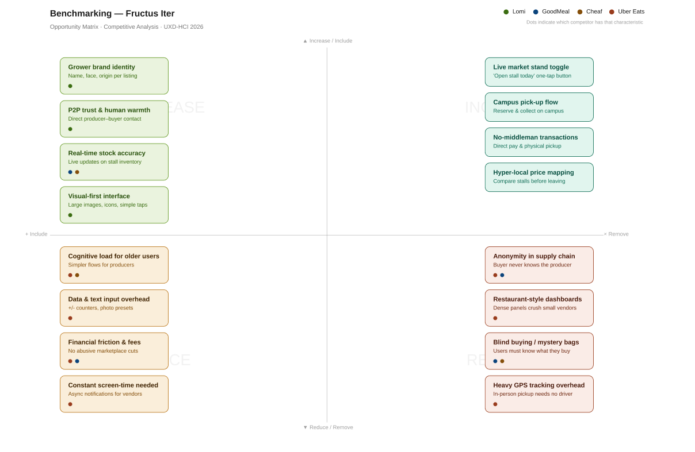
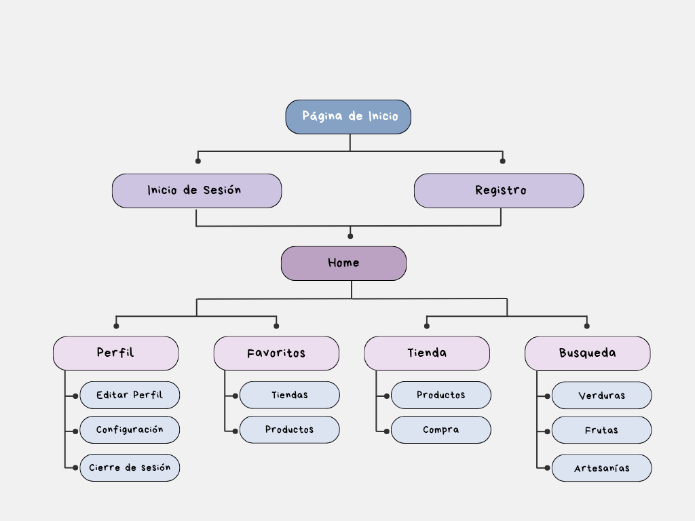

# 🌿 Fructus Iter

> A mobile-first digital marketplace connecting local producers, farmers, and artisans from La Araucanía, Chile, with buyers at weekly fairs and local markets.

**Course:** Diseño de Experiencia de Usuario e Interacción Humano Computador — UXD-HCI 2026  
**Department:** Departamento de Cs. Computación e Informática  
**University:** Universidad de La Frontera (UFRO), Temuco, Chile

---

## Index

1. [Introduction](#1-introduction)
   - [1.1. The Problem](#11-the-problem)
   - [1.2. Our Solution](#12-our-solution)
2. [Team & Roles](#2-team--roles)
3. [Strategy](#3-strategy)
   - [3.1. Value Proposition Canvas](#31-value-proposition-canvas)
   - [3.2. UX Personas](#32-ux-personas)
   - [3.3. Benchmark Analysis](#33-benchmark-analysis)
4. [Scope](#4-scope)
   - [4.1. Functional Requirements](#41-functional-requirements)
   - [4.2. Restrictions](#42-restrictions)
   - [4.3. Navigation Patterns](#43-navigation-patterns-adopted-from-benchmark)
5. [Structure](#5-structure)
   - [5.1. Navigation Flow](#51-navigation-flow)
6. [Skeleton](#6-skeleton)
   - [6.1. Low-Fi Wireframes](#61-low-fi-wireframes)
7. [Surface](#7-surface)
   - [7.1. Interface Evolution](#71-interface-evolution)
   - [7.2. Heuristic Evaluation](#72-heuristic-evaluation)
   - [7.3. Accessibility](#73-accessibility)
   - [7.4. High Definition Interfaces](#74-high-definition-interfaces)
8. [Annex](#8-annex)

---

## 1. Introduction

### 1.1. The Problem

Local producers from La Araucanía — horticulturists, Mapuche artisans, and beekeepers — lack digital channels to publish their weekly offerings, coordinate pre-orders, and build a loyal customer base. Existing e-commerce platforms do not adapt to the seasonal rhythm or local market logic, where **trust and proximity** are core values for buyers.

> *"As a beekeeper from Cunco who sells at the Temuco fair on Saturdays, I need to publish my weekly honey offer with my contact information, receive pre-orders through the app, and have my regular customers find me easily — so I can sell all my stock without bringing product back home."*

**Key pain points identified:**

- Producers have no digital channel to announce their weekly stock before fair day
- Buyers don't know what's available until they physically arrive at the market
- No mechanism for pre-orders or reservations between producers and regular customers
- Existing platforms don't reflect the seasonal, trust-based logic of local fairs

---

### 1.2. Our Solution

**Fructus Iter** is a mobile-first marketplace that bridges the gap between local fair producers and buyers. It enables producers to publish their weekly stock, receive pre-orders, and build a loyal digital customer base — while giving buyers transparent access to fresh, locally sourced products before fair day.

**🌱 Producer Features**
- Publish weekly stock with photos, prices, and availability before fair day
- Receive and manage pre-orders from regular customers
- Build a loyal digital customer base with direct contact tools

**🛒 Buyer Features**
- Browse local producers and their weekly offerings from the app
- Pre-order products and reserve stock before arriving at the fair
- Campus pick-up flow for UFRO staff and students
- Transparent pricing with no hidden fees or intermediaries

---

## 2. Team & Roles

| Name | Role | Responsibilities |
|---|---|---|
| **Felipe Medina** | Project Lead & Designer | Coordination, presentation leadership, formal deliverable models and UI design |
| **Stephanie Mercado** | Analyst & Designer | User interviews, annotations, needs conceptualization, UI design |

---

## 3. Strategy

> *The Strategy plane defines why the product exists: what the users need and what the business/project wants to achieve.*

### 3.1. Value Proposition Canvas

The Value Proposition Canvas maps the alignment between producer and buyer pain points and the platform's gain creators and pain relievers.

**Key customer jobs identified:**
- Sell all weekly stock without returning unsold produce
- Publish product offerings digitally before fair day
- Access fresh, locally sourced produce without visiting the fair in person
- Plan weekly purchases in advance with transparent pricing

**Key pains addressed:**
- Unsold produce at the end of fair days
- No digital channel for producers to reach customers
- Buyers unaware of available stock until physical arrival
- Supermarket alternatives are more expensive and less fresh

📄 [Value Proposition Canvas — English Version](Tareas/Value%20Proposition%20Canvas/Value%20Proposition%20Canvas%20(English%20Version).pdf)  
📄 [Value Proposition Canvas — Spanish Version](Tareas/Value%20Proposition%20Canvas/Value%20Proposition%20Canvas.pdf)

---

### 3.2. UX Personas

Three personas were identified based on field context and the user story provided for the project scenario. Each persona represents a distinct user type with unique needs, frustrations, and technology usage patterns.

#### 👤 Juan Catrileo — Fair Vendor (Producer)
> *"I leave at 4 in the morning and sometimes come back with half my stock. I don't have time to let all my customers know what I brought."*

- 52 years old · Cunco, La Araucanía · Primary education
- **Key need:** Publish weekly stock and receive pre-orders before Saturday
- **Main frustration:** Produce that rots unsold, no digital channel of his own

#### 👤 Marcela Vidal — UFRO Administrative Staff (Buyer)
> *"I want to eat healthy during the week, but I don't have time to go to the fair on Saturday. I need to know what's available and have someone reserve it for me."*

- 41 years old · Temuco · Technical university degree
- **Key need:** Pre-order fresh produce without going to the fair
- **Main frustration:** The fair closes before she finishes work, supermarket fruit is less fresh

#### 👤 Diego Painevil — University Student (Buyer)
> *"I buy at the supermarket because I don't know what's at the fair or how much it costs. If I could see the products with prices before going, I'd go often."*

- 21 years old · UFRO student · Fixed monthly budget
- **Key need:** Know what's available and compare prices before leaving campus
- **Main frustration:** Doesn't know what's being sold, arrives late and stock is gone

.png)
.png)
.png)

---

### 3.3. Benchmark Analysis

Competitive analysis conducted following the two-phase methodology: **Exploratory Phase** (mapping the ecosystem) and **Competitive Reference Phase** (in-depth analysis for design decisions).

#### Tool Selection & Justification

| # | Tool | Category | Justification |
|---|---|---|---|
| 1 | **Lomi** | Direct Competitor | Chilean marketplace connecting local producers with buyers directly. Same problem, same cultural and market context. |
| 2 | **GoodMeal** | Analogous Competitor | Chilean food rescue app with 1M+ users. Handles fresh food surplus but uses mystery bags — fundamentally different UX logic. |
| 3 | **Cheaf** | Analogous Competitor | Chilean surplus food app with 1.5M users. Works with fruits, vegetables, and dairy via a pick-up model. |
| 4 | **Uber Eats** | Design Reference | Sets the UX standard for food delivery catalogs, ordering flows, and order tracking at scale. |

#### Opportunity Matrix (ERIC Framework)

| Quadrant | Key Insights |
|---|---|
| ↑ **Increase** | Grower brand identity · P2P trust & human warmth · Real-time stock accuracy · Visual-first interface |
| + **Include** | Live market stand toggle · Campus pick-up flow · No-middleman transactions · Hyper-local price mapping |
| ↓ **Reduce** | Cognitive load for older users · Data & text input overhead · Financial friction & fees · Constant screen-time dependency |
| × **Remove** | Anonymity in supply chain · Restaurant-style dashboards · Blind buying / mystery bags · Heavy GPS tracking overhead |

**Key differentiator:** Fructus Iter is the only solution in this domain that combines visible producer identity, no-middleman transactions, and a campus-oriented pick-up flow tailored for the UFRO community.



---

## 4. Scope

> *The Scope plane defines what the product does and does not do: which features are in, which are out, and why.*

### 4.1. Functional Requirements

Based on the benchmark analysis and the three UX personas, the following functionalities were defined as core scope:

| # | Functionality | Persona | Source |
|---|---|---|---|
| 1 | Weekly stock publishing by producer | Juan Catrileo | Benchmark gap — no competitor solves this |
| 2 | Pre-order before fair day | Marcela Vidal | Value Proposition Canvas |
| 3 | Producer identity visible on every listing | All personas | ERIC Matrix — Increase |
| 4 | Campus pick-up flow | Marcela / Diego | ERIC Matrix — Include |
| 5 | Product catalog with search and filters | Diego Painevil | Domain standard (all competitors) |
| 6 | Cart, checkout and order confirmation | Marcela Vidal | Domain standard (all competitors) |
| 7 | Delivery option | Marcela Vidal | Added based on user feedback |
| 8 | Order tracking / pickup status | All personas | Benchmark reference — Uber Eats |
| 9 | Favorites (stores and products) | Marcela Vidal | Domain standard (all competitors) |
| 10 | User profile and settings | All personas | Domain standard (all competitors) |
| 11 | Direct seller contact (chat / WhatsApp) | Juan Catrileo | ERIC Matrix — Include |

---

### 4.2. Restrictions

The following functionalities were identified in competitors but **consciously excluded** from Fructus Iter's scope:

| Excluded Feature | Reason | Competitor that has it |
|---|---|---|
| Mystery bags / blind buying | Destroys producer identity — core to our value proposition | GoodMeal, Cheaf |
| Restaurant-style vendor dashboard | Too complex for producers with low digital literacy | Uber Eats |
| Subscription or membership model | Creates financial barriers for small producers | GoodMeal |
| Algorithmic feed / sponsored listings | Introduces hidden fees and anonymity in the supply chain | Uber Eats |
| QR code at pick-up | Creates a barrier for older users with low digital literacy — replaced by numeric order code | — |

---

### 4.3. Navigation Patterns Adopted from Benchmark

| Pattern | Adopted from | Decision |
|---|---|---|
| Bottom navigation bar (5 tabs) | Uber Eats / Lomi | ✅ Adopted — industry standard, users arrive with this expectation |
| Product card with image + price + producer | Lomi | ✅ Adopted — reinforces producer identity |
| Quantity selector +/- on product detail | Uber Eats | ✅ Adopted — reduces text input overhead |
| Step-by-step order status (Accepted → Packed → Delivered) | Uber Eats | ✅ Adopted — clear progress feedback |
| Mystery bag / surprise purchase flow | GoodMeal / Cheaf | ❌ Rejected — users must know exactly what they are buying |

---

## 5. Structure

> *The Structure plane defines how the product is organized: how screens connect and how users move through the app.*

### 5.1. Navigation Flow

The navigation diagram covers all app functionalities across both user roles (producer and buyer), from onboarding through to order tracking and profile management.

```
Landing Page
├── Sign In
└── Register
    └── Home
        ├── Profile
        │   ├── Edit Profile
        │   ├── Settings
        │   └── Sign Out
        ├── Favorites
        │   ├── Stores
        │   └── Products
        ├── Store
        │   ├── Products
        │   └── Purchase → Cart → Payment → Confirmation
        └── Search
            ├── Vegetables
            ├── Fruits
            └── Crafts
```



---

## 6. Skeleton

> *The Skeleton plane defines the arrangement of interface elements: where components are placed on screen and how they support the user's tasks.*

### 6.1. Low-Fi Wireframes

Initial paper wireframes covering all core user flows, digitized and organized by functional group. The wireframes represent the first design iteration before any visual decisions were made.

| Flow | Screens covered |
|---|---|
| Onboarding | Sign In · Register |
| Home & Browse | Home · Search · Categories |
| Catalog & Product | Product list · Product detail |
| Cart & Checkout | Cart · Payment · Order confirmation |
| Pickup & Tracking | Order tracking · Delivery status |
| Favorites | Add to favorites · My favorites |
| Profile | My profile · Edit profile · Settings |

📄 [Low-Fi Wireframes — Avance 1 (PDF)](Avance_1/Wireframes_Avance1/Wireframe_avance1.pdf)

---

## 7. Surface

> *The Surface plane defines the visual design of the product: colors, typography, icons, images, and the final look and feel of every screen.*

### 7.1. Interface Evolution

The design evolved through multiple iterations guided by usability feedback received during Avance 1. Below is a summary of the corrections applied to each screen.

| Screen | Feedback Received | Correction Applied |
|---|---|---|
| **Product Detail** | Add status bar, unit switcher (kg/g), navbar, justify text | Added status bar, unit selector, navbar, justified text |
| **Cart** | Review possibility of changing delivery address | Moved delivery data to the next view (checkout) |
| **Checkout** | Separate delivery options | Added two flows: home delivery and pick-up in store |
| **Order Tracking** | Maintain coherence, reduce redundancy | Simplified tracking screen, removed redundant elements |
| **Profile** | Add payment methods, fix padding | Added payment methods section and corrected padding |
| **Heart Icons** | Hearts too large for the circle, repeated across screens | Resized heart icons consistently across all screens |
| **Favorites** | Back arrow made no sense, missing navbar | Removed arrow, added navbar for navigation |
| **Home** | Border trace inconsistency, missing back arrow logic | Removed erroneous border, removed back arrow |
| **Sign In** | No way to switch to Register | Added "Don't have an account? Register" link |
| **Register** | No way to switch to Sign In | Added "Already have an account? Sign In" link |

📄 [Interface Evolution — UX Refactoring (Avance 2)](Avance_2/Interface_Evolution/Interface_Evolution.pdf)

---

### 7.2. Heuristic Evaluation

A heuristic evaluation was conducted on the high-fidelity Fructus Iter prototype using Nielsen's 10 usability heuristics as the evaluation framework. The findings directly informed the interface corrections documented in section 7.1.

📄 [Heuristic Evaluation (PDF)](Avance_2/Heuristic%20Evaluation/Heuristic_Evaluation.pdf)

---

### 7.3. Accessibility

Accessibility was a core design consideration for Fructus Iter given that one of our primary user personas — Juan Catrileo, 52 years old, with basic primary education — represents a segment of users with limited digital literacy. The following accessibility decisions were made during the design process:

| Design Decision | Accessibility Rationale |
|---|---|
| **Numeric order code instead of QR** | QR codes require users to understand how to scan them. Older producers and buyers are more familiar with numeric codes, reducing the learning curve and potential errors at pick-up. |
| **Large touch targets (min. 48×48px)** | Ensures that users with reduced motor precision — common in older adults — can tap buttons and controls without errors. |
| **High contrast green system** (`#2E7D32` on white) | Meets WCAG AA contrast ratio requirements, supporting users with low vision or color perception difficulties. |
| **Visual-first product cards with large images** | Reduces dependence on reading ability for users with lower literacy levels, letting them identify products visually. |
| **Simple bottom navigation with labels** | Icon-only navigation is a known accessibility barrier. All 5 nav items include text labels below the icon. |
| **+/- quantity selectors instead of text input** | Eliminates the need to type numbers, which is a common difficulty for older or less tech-savvy users. |
| **Delivery and pick-up options clearly separated** | Users with cognitive or attention difficulties benefit from explicit, non-ambiguous checkout flows with one clear decision per step. |
| **Spanish-only interface** | All UI text is in Spanish to match the native language of all target users in La Araucanía, reducing cognitive load. |

📄 [Accessibility Analysis (PDF)](Avance_2/Accessibility/Accessibility%20in%20Discord.pdf)

---

### 7.4. High Definition Interfaces

High-fidelity screens for all functionalities designed in Figma, following the app's green color system and accessible UI patterns informed by the benchmark and heuristic evaluation.

**Design system:**
- Primary green: `#2E7D32` · Medium green: `#4CAF50` · Background: `#F1F8F0`
- Typography: Inter / SF Pro · Rounded corners: 16–24px · Subtle card shadows

**Key screens:**
- Onboarding (Sign Up / Sign In)
- Home with category grid and featured products
- Product catalog and detail view
- Cart, checkout with two options (home delivery & campus pick-up), and order confirmation
- Order tracking for both delivery and pick-up flows
- Favorites (stores and products)
- Profile, payment methods, and settings

🔗 [Figma Prototype — Fructus Iter](https://www.figma.com/design/aAvGQ0lL6xu3XAz2v8vcvm/Fructus-Iter?node-id=329-3128&p=f&t=W8TL7ZePVDXgkSBs-0)

---

## 8. Annex

Central repository of all project deliverables, organized by UX design plane.

### 📐 Strategy

| Deliverable | File | Description |
|---|---|---|
| Value Proposition Canvas (EN) | [PDF](Tareas/Value%20Proposition%20Canvas/Value%20Proposition%20Canvas%20(English%20Version).pdf) | Alignment between user needs and platform value |
| Value Proposition Canvas (ES) | [PDF](Tareas/Value%20Proposition%20Canvas/Value%20Proposition%20Canvas.pdf) | Spanish version |
| UX Persona — Juan Catrileo | [PNG](Tareas/UX_personas/JuanCatrileo(EnglishVersion).png) | Producer persona |
| UX Persona — Marcela Vidal | [PNG](Tareas/UX_personas/MarcelaVidal(EnglishVersion).png) | Buyer persona (UFRO staff) |
| UX Persona — Diego Painevil | [PNG](Tareas/UX_personas/DiegoPainevil(EnglishVersion).png) | Buyer persona (student) |

### 🎯 Scope

| Deliverable | File | Description |
|---|---|---|
| Benchmark Opportunity Matrix | [PNG](Tareas/Benchmark/Benchmark_Map.png) | ERIC framework comparing Lomi, GoodMeal, Cheaf, Uber Eats |

### 🗺️ Structure

| Deliverable | File | Description |
|---|---|---|
| Navigation Flow Diagram | [PNG](Tareas/Diagrama_navegacion/Diagrama_navegacion.png) | Complete navigation architecture |

### 📐 Skeleton

| Deliverable | File | Description |
|---|---|---|
| Low-Fi Wireframes — Avance 1 | [PDF](Avance_1/Wireframes_Avance1/Wireframe_avance1.pdf) | Full wireframe set organized by user flow |

### 🎨 Surface

| Deliverable | File | Description |
|---|---|---|
| Interface Evolution | [PDF](Avance_2/Interface_Evolution/Interface_Evolution.pdf) | Before/after corrections from Avance 1 feedback |
| Heuristic Evaluation | [PDF](Avance_2/Heuristic%20Evaluation/Heuristic_Evaluation.pdf) | Nielsen's 10 heuristics applied to the HD prototype |
| Accessibility Analysis | [PDF](Avance_2/Accessibility/Accessibility%20in%20Discord.pdf) | Accessibility decisions applied to Fructus Iter (numeric codes, large targets, contrast, etc.) |
| Figma Prototype (HD) | [Open in Figma](https://www.figma.com/design/aAvGQ0lL6xu3XAz2v8vcvm/Fructus-Iter?node-id=329-3128&p=f&t=W8TL7ZePVDXgkSBs-0) | Navigable high-definition prototype |

---

> **UXD-HCI 2026 · Universidad de La Frontera · Temuco, Chile**  
> *All repository documentation is written in English as per course requirements.*  
> *Application interfaces are in Spanish as per course requirements.*
